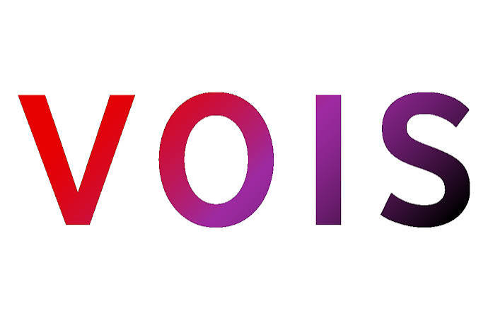

<!-- Dynamic Typing SVG -->

  
  
  
  

---

## 🧑‍💻 About Me

A recent **B.Eng. graduate in Computer Engineering** from the Faculty of Automatic Control and Computer Science (ACS, UPB). Driven, persistent, and highly organized, with a strong passion for system-level development and intelligent architectures.

Proficient in **Python, Java, and C/C++**, backed by a solid foundation in data structures, algorithms, and OOP.

🎯 **Core Interests:**
- 🖥️ Low-Level Systems & OS Internals
- 🌐 Computer Networks & the OSI Stack
- 🧠 Machine Learning & AI
- ⚡ Performance Optimization & Computer Architecture

🗣️ **Languages:** Romanian (Native) · English (Professional Working Proficiency)

> *"Driven by the challenge of bridging the gap between bare-metal infrastructure and intelligent software."*

---

## 🏢 Experience

<table>
  <tr>
    <td width="100" align="center">
      
    </td>
    <td>
      <b>Network Operations Center Engineer</b> · Internship 
      <a href="https://www.vodafone.com/">VOIS</a> · Jun 2025 – Sep 2025 
      📍 Bucharest, Romania 
      🔧 TCP/IP · Network Monitoring · Transmission Lines · Incident Management
    </td>
  </tr>
</table>

---

## 🛠️ Tech Stack

<b>Languages</b>

 

  

<b>ML / Data Science</b>

 

  
  
  
  
  
  

<b>Systems, Tools & Platforms</b>

 

  
  
  
  

---

## 🌟 Featured Projects

<table>
<tr>
  <td width="50%" valign="top">
    <h3 align="center">🛡️ SysGuard AI</h3>
    
<em>Graduation Thesis · Full-Stack System Telemetry Platform</em>

    

      Intelligent monitoring & optimization platform with a decoupled 3-tier architecture.
        
      ⚡ Native Windows hardware collector daemon (sub-second telemetry) 
      🧠 LSTM forecasting for CPU/RAM + Random Forest disk failure prediction 
      🔧 Automated optimization: RAM flushing, core affinity, memory leak detection 
      📡 Alerts via Telegram, Discord & Email with deduplication logic
    

    

      
      
      
      
      
    

  </td>
  <td width="50%" valign="top">
    <h3 align="center">🧠 ML: NLP & Computer Vision</h3>
    
<em>Dual-Task Deep Learning Project</em>

    

      End-to-end PyTorch pipeline for two core ML tasks.
        
      💬 Binary sentiment analysis via Bidirectional LSTMs + BERT data augmentation 
      🖼️ 10-class image classification with CNNs & transfer learning 
      📊 Full training pipelines with evaluation metrics
    

    

      
      
      
    

  </td>
</tr>
<tr>
  <td width="50%" valign="top">
    <h3 align="center">🔍 PEBS Memory Tracer</h3>
    
<em>Hardware-Level Memory Access Analysis</em>

    

      Lightweight, real-time memory access tracer for Linux.
        
      📡 Leverages Intel PEBS via <code>perf_event_open</code> 
      📊 Live Matplotlib heatmap dashboard 
      ⚙️ Captures hardware-level load/store events in real-time
    

    

      
      
      
    

  </td>
  <td width="50%" valign="top">
    <h3 align="center">📚 Mini-libc</h3>
    
<em>Custom C Standard Library for Linux</em>

    

      Minimalist C standard library implementation from scratch.
        
      🔤 String manipulation functions 
      🧱 Memory management (malloc, free, etc.) 
      📂 POSIX file I/O with raw syscalls
    

    

      
      
      
    

  </td>
</tr>
<tr>
  <td width="50%" valign="top">
    <h3 align="center">🔀 Ethernet Switch</h3>
    
<em>Software-Defined Network Switch</em>

    

      MAC learning, VLAN (802.1Q) tagging, and Spanning Tree Protocol (STP) — implemented in software.
    

    

      
      
    

  </td>
  <td width="50%" valign="top">
    <h3 align="center">🌐 Router Dataplane</h3>
    
<em>Packet Routing in C</em>

    

      Custom router dataplane handling packet forwarding via routing table lookups and ARP protocol resolution.
    

    

      
      
    

  </td>
</tr>
<tr>
  <td width="50%" valign="top">
    <h3 align="center">💣 Embedded Minesweeper</h3>
    
<em>Arduino + TFT Display Game</em>

    

      Fully playable Minesweeper on embedded hardware — joystick, buttons, and real-time TFT rendering.
    

    

      
      
    

  </td>
  <td width="50%" valign="top">
    <h3 align="center">🪖 Tank Wars</h3>
    
<em>OpenGL Interactive Game</em>

    

      3D game with deformable terrain, mobile tanks, projectile physics & collision detection.
    

    

      
      
    

  </td>
</tr>
</table>

> 📂 *See all [28 projects](https://www.linkedin.com/in/mihai-daniel-lemnaru-0605852a2/details/projects/) on my LinkedIn.*

---

## 📊 GitHub Stats

  
  

  

---

## 📈 Contribution Graph

<picture>
  <source media="(prefers-color-scheme: dark)" srcset="https://raw.githubusercontent.com/PXrotters/PXrotters/output/pacman-contribution-graph-dark.svg">
  <source media="(prefers-color-scheme: light)" srcset="https://raw.githubusercontent.com/PXrotters/PXrotters/output/pacman-contribution-graph.svg">
  
</picture>

---

  

